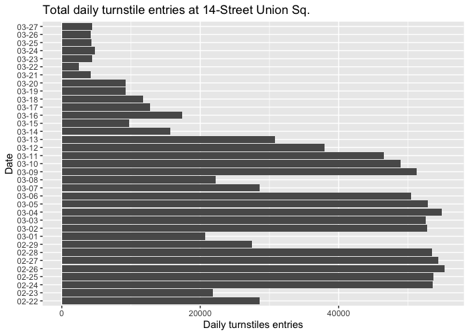

Analyzing MTA Turnstile data
================
April 2020

This markdown is to explain how to analyze turnstile data from the MTA
website in R.

Data can be found here: <http://web.mta.info/developers/turnstile.html>.

``` r
library(tidyverse)
library(readxl)

mta <- read_csv("/Users/eliasguerra/interactives/mta_turnstile/data/mta_example14st.csv") 
# This is just a shortened file. You can find the full one in file /data. 
```

Begin by loading the necessary libraries and reading in the data. I’m
using the tidyverse packages for most of the analysis so that code looks
different from base R. Next I’m going to clean up the data a bit.

Let’s take a look at the whole data frame.

``` r
str(mta)
```

    ## tibble [5,669 × 11] (S3: spec_tbl_df/tbl_df/tbl/data.frame)
    ##  $ C/A     : chr [1:5669] "A033" "A033" "A033" "A033" ...
    ##  $ UNIT    : chr [1:5669] "R170" "R170" "R170" "R170" ...
    ##  $ SCP     : chr [1:5669] "'02-00-00" "'02-00-00" "'02-00-00" "'02-00-00" ...
    ##  $ STATION : chr [1:5669] "14 ST-UNION SQ" "14 ST-UNION SQ" "14 ST-UNION SQ" "14 ST-UNION SQ" ...
    ##  $ LINENAME: chr [1:5669] "LNQR456W" "LNQR456W" "LNQR456W" "LNQR456W" ...
    ##  $ DIVISION: chr [1:5669] "BMT" "BMT" "BMT" "BMT" ...
    ##  $ DATE    : POSIXct[1:5669], format: "2020-03-27" "2020-03-27" ...
    ##  $ TIME    : POSIXct[1:5669], format: "1899-12-31 01:00:00" "1899-12-31 05:00:00" ...
    ##  $ DESC    : chr [1:5669] "REGULAR" "REGULAR" "REGULAR" "REGULAR" ...
    ##  $ ENTRIES : num [1:5669] 337556 337556 337558 337563 337578 ...
    ##  $ EXITS   : num [1:5669] 1029327 1029331 1029381 1029418 1029468 ...
    ##  - attr(*, "spec")=
    ##   .. cols(
    ##   ..   `C/A` = col_character(),
    ##   ..   UNIT = col_character(),
    ##   ..   SCP = col_character(),
    ##   ..   STATION = col_character(),
    ##   ..   LINENAME = col_character(),
    ##   ..   DIVISION = col_character(),
    ##   ..   DATE = col_datetime(format = ""),
    ##   ..   TIME = col_datetime(format = ""),
    ##   ..   DESC = col_character(),
    ##   ..   ENTRIES = col_double(),
    ##   ..   EXITS = col_double()
    ##   .. )

We’re going to need to reformat the date.

``` r
mta$DATE[2]
```

    ## [1] "2020-03-27 UTC"

``` r
mta_date <- as.character.Date(mta$DATE) %>% str_sub(1,10)
mta_time <- as.character(mta$TIME) %>% str_sub(12,21)
mta_dt <- paste(mta_date,"T",mta_time, sep = "") %>% lubridate::ymd_hms()

mta$date_time <- mta_dt
mta$just_date <- mta_date
mta$just_time <- mta_time

mta$date_time[2]
```

    ## [1] "2020-03-27 05:00:00 UTC"

New look, same great taste.

When you look at “ENTRIES” you see that they’re not starting from 0 so
we’re going to fix
    that.

``` r
head(mta$ENTRIES, 12)
```

    ##  [1]  337556  337556  337558  337563  337578  337594 2545124 2545124
    ##  [9] 2545130 2545136 2545150 2545161

``` r
# Create new column "new.entries" and "new.exits" 
# calculated from cumulative "ENTRIES"/"EXITS" for each station
new_entries <- vector(length = nrow(mta))
new_exits <- vector(length = nrow(mta))
new_scp <- vector(length = nrow(mta)) # new_scp indicates device ID (dif turnstile?)
for (i in 1:nrow(mta)) {
  new_entries[i] <- mta$ENTRIES[i+1] - mta$ENTRIES[i]
  new_exits[i] <- mta$EXITS[i+1] - mta$EXITS[i]
  new_scp[i] <- mta$SCP[i+1] != mta$SCP[i]
}

mta$new_entries <- new_entries # Not the same as "ENTRIES" 
mta$new_exits <- new_exits
new_scp[1] <- TRUE
mta$new_scp <- new_scp

head(mta, 2)
```

    ## # A tibble: 2 x 17
    ##   `C/A` UNIT  SCP   STATION LINENAME DIVISION DATE               
    ##   <chr> <chr> <chr> <chr>   <chr>    <chr>    <dttm>             
    ## 1 A033  R170  '02-… 14 ST-… LNQR456W BMT      2020-03-27 00:00:00
    ## 2 A033  R170  '02-… 14 ST-… LNQR456W BMT      2020-03-27 00:00:00
    ## # … with 10 more variables: TIME <dttm>, DESC <chr>, ENTRIES <dbl>,
    ## #   EXITS <dbl>, date_time <dttm>, just_date <chr>, just_time <chr>,
    ## #   new_entries <dbl>, new_exits <dbl>, new_scp <lgl>

``` r
mta_cleanr <- mta %>%
  filter(new_scp == F) %>% 
  select(date_time,STATION, LINENAME, SCP, ENTRIES, new_entries, new_exits, just_date, just_time)
head(mta_cleanr, 10)
```

    ## # A tibble: 10 x 9
    ##    date_time           STATION LINENAME SCP   ENTRIES new_entries new_exits
    ##    <dttm>              <chr>   <chr>    <chr>   <dbl>       <dbl>     <dbl>
    ##  1 2020-03-27 05:00:00 14 ST-… LNQR456W '02-…  3.38e5           2        50
    ##  2 2020-03-27 09:00:00 14 ST-… LNQR456W '02-…  3.38e5           5        37
    ##  3 2020-03-27 13:00:00 14 ST-… LNQR456W '02-…  3.38e5          15        50
    ##  4 2020-03-27 17:00:00 14 ST-… LNQR456W '02-…  3.38e5          16        21
    ##  5 2020-03-27 01:00:00 14 ST-… LNQR456W '02-…  2.55e6           0         3
    ##  6 2020-03-27 05:00:00 14 ST-… LNQR456W '02-…  2.55e6           6        67
    ##  7 2020-03-27 09:00:00 14 ST-… LNQR456W '02-…  2.55e6           6        32
    ##  8 2020-03-27 13:00:00 14 ST-… LNQR456W '02-…  2.55e6          14        34
    ##  9 2020-03-27 17:00:00 14 ST-… LNQR456W '02-…  2.55e6          11        13
    ## 10 2020-03-27 01:00:00 14 ST-… LNQR456W '02-…  1.51e7           0         3
    ## # … with 2 more variables: just_date <chr>, just_time <chr>

``` r
#This will take the total rides per day and the average rides every four hours. 
mta_perday <-
  mta_cleanr %>%
  group_by(STATION, just_date) %>%
  summarise(avg_entries = mean(new_entries), # avg is four each unit of time data was collected, four hours
            total_entries = sum(new_entries),
            avg_exits = mean(new_exits),
            total_exits = sum(new_exits)) %>%
  filter(just_date != "1899-12-31") # This date gets included for some reason
head(mta_perday, 10)
```

    ## # A tibble: 10 x 6
    ## # Groups:   STATION [1]
    ##    STATION        just_date avg_entries total_entries avg_exits total_exits
    ##    <chr>          <chr>           <dbl>         <dbl>     <dbl>       <dbl>
    ##  1 14 ST-UNION SQ 2020-02-…        212.         28555      217.       29266
    ##  2 14 ST-UNION SQ 2020-02-…        162.         21871      156.       21021
    ##  3 14 ST-UNION SQ 2020-02-…        397.         53584      420.       56657
    ##  4 14 ST-UNION SQ 2020-02-…        398.         53719      429.       57897
    ##  5 14 ST-UNION SQ 2020-02-…        410.         55324      444.       59991
    ##  6 14 ST-UNION SQ 2020-02-…        403.         54424      439.       59274
    ##  7 14 ST-UNION SQ 2020-02-…        396.         53439      431.       58242
    ##  8 14 ST-UNION SQ 2020-02-…        203.         27424      212.       28566
    ##  9 14 ST-UNION SQ 2020-03-…        153.         20696      153.       20614
    ## 10 14 ST-UNION SQ 2020-03-…        391.         52761      415.       56080

We have a our data in a form we can use now.

``` r
head(mta_cleanr) #This is the cleaned up data
```

    ## # A tibble: 6 x 9
    ##   date_time           STATION LINENAME SCP   ENTRIES new_entries new_exits
    ##   <dttm>              <chr>   <chr>    <chr>   <dbl>       <dbl>     <dbl>
    ## 1 2020-03-27 05:00:00 14 ST-… LNQR456W '02-…  337556           2        50
    ## 2 2020-03-27 09:00:00 14 ST-… LNQR456W '02-…  337558           5        37
    ## 3 2020-03-27 13:00:00 14 ST-… LNQR456W '02-…  337563          15        50
    ## 4 2020-03-27 17:00:00 14 ST-… LNQR456W '02-…  337578          16        21
    ## 5 2020-03-27 01:00:00 14 ST-… LNQR456W '02-… 2545124           0         3
    ## 6 2020-03-27 05:00:00 14 ST-… LNQR456W '02-… 2545124           6        67
    ## # … with 2 more variables: just_date <chr>, just_time <chr>

Time to graph it.

``` r
mta_perday %>% filter(STATION == "14 ST-UNION SQ") %>%
  mutate(month_day = str_sub(just_date, 6,10)) %>%
  ggplot(aes(x = month_day, y = total_entries)) +
  geom_bar(stat = "identity") +
  ylab("Daily turnstiles entries") + xlab("Date") + 
  ggtitle("Total daily turnstile entries at 14-Street Union Sq.", ) +
  coord_flip() 
```

<!-- -->
